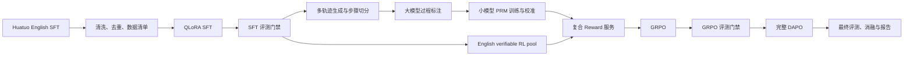

# Clinical-o1 英文主线端到端实施计划

> 状态：M0/M1 已完成；M2 由项目负责人决定延期；M3 Stage 3 代码已实现，待 RTX 4090 实跑（2026-07-10）
> 主模型：`Qwen/Qwen2.5-7B-Instruct`
> 主路线：English SFT → PRM/Verifier → GRPO → DAPO → 全量评测与消融
> 本文是后续实现和实验的唯一权威路线图；旧阶段文档与未验收代码已经删除。

## 1. 最终目标

构建一条可复现、可评测、可解释的医疗复杂推理强化学习闭环：

1. 使用 HuatuoGPT-o1 英文复杂 CoT 数据完成 Qwen2.5-7B-Instruct 的 QLoRA SFT。
2. 从医疗推理轨迹中构造 step-level 过程监督数据，训练或校准小型 PRM。
3. 使用“格式硬约束 + 结果 Verifier + 连续 Judge + 过程 Reward”的复合奖励跑通 GRPO。
4. 在稳定 GRPO 基线上加入 DAPO 的 token-level loss、Clip-Higher、Dynamic Sampling 和 Overlong Reward Shaping。
5. 在 MedQA、MedMCQA、PubMedQA 上完成 Base/SFT/GRPO/DAPO 的公平对比、统计检验和 Reward 消融。

最终只把真实复现实验写入项目结论。`MedQA 65.82%`、`MedMCQA 62.0%` 是目标，不是预设结果；没有完整日志和评测产物时不得写成已完成成果。

## 2. 已确定的工程原则

### 2.1 英文主线优先

- SFT：`FreedomIntelligence/medical-o1-reasoning-SFT` 的 `en` 子集。
- RL：`FreedomIntelligence/medical-o1-verifiable-problem`。
- 主评测：English MedQA-USMLE、MedMCQA、PubMedQA。
- 现有中文 SFT 不再作为英文 GRPO 的初始化模型，只保留为历史实验和后续中文分支参考。

### 2.2 新实验产物隔离

- 历史 `outputs/` 已按项目负责人授权删除；仓库不再声称保留旧中文训练结果。
- `outputs/` 不提交 Git，但租卡实例释放前必须把通过门禁的关键 adapter、checkpoint、日志和评测结果同步到持久存储。
- 新实验使用唯一运行目录：`outputs/<stage>/<run_id>/`。
- `<run_id>` 统一为 `<model>_<data>_<method>_<seed>_<timestamp>`，禁止把不同实验写入同一目录。
- 重构前先生成 `reports/artifact_inventory.json`，记录历史产物路径、大小、关键指标和 SHA256。

### 2.3 训练、开发集与最终测试严格隔离

- MedQA test、MedMCQA validation、PubMedQA 最终测试集只用于正式 checkpoint 评测。
- 调参、早停和 Reward 选择使用训练数据中额外划出的 development set。
- 所有训练数据必须对最终评测题做污染检查：标准化精确匹配、连续 64 字符匹配、字符 5-gram Jaccard、字符 TF-IDF cosine 四层筛查。
- 污染报告和被排除样本 ID 必须落盘，不能只在终端打印。

### 2.4 GRPO 与 DAPO 必须分阶段验收

- 先得到稳定、可复现、优于 SFT 的 GRPO，再实现 DAPO。
- “配置文件能构造 Trainer”不等于算法已经跑通。
- 缺少 Dynamic Sampling 时只能称为 `DAPO-style`，四项机制全部实现后才能称为完整 DAPO 实验。

## 3. 目标数据流



## 4. 目标仓库结构

仓库按里程碑渐进生长：下列后续目录只在对应实现通过测试后创建，不提前放置占位代码。

```text
Clinical-o1/
├── PLAN.md
├── README.md
├── pyproject.toml                  # 固定依赖、lint、test 配置
├── configs/                        # 到达对应里程碑后再创建已验证配置
├── data/
│   ├── raw/                        # 不提交的大体积原始数据
│   ├── interim/                    # 清洗和去重中间产物
│   ├── processed/                  # 可直接训练/评测的数据
│   └── manifests/                  # revision、hash、行数、字段、污染报告
├── src/medical_grpo/
│   ├── data/
│   ├── sft/                         # Stage 3 配置、数据边界、模型与训练编排
│   ├── eval/
│   ├── rewards/
│   ├── trainers/
│   ├── prm/
│   └── tracking/
├── tests/
│   ├── unit/
│   ├── integration/
│   └── fixtures/
├── reports/
│   ├── runs/
│   ├── tables/
│   ├── figures/
│   └── artifact_inventory.json
└── outputs/                        # 本机生成；每个 run 使用唯一目录
```

## 5. Stage 0：冻结历史结果并重构工程骨架

### 工作项

- [x] 曾清点旧 `outputs/` 并生成 artifact inventory；随后按项目负责人明确授权删除旧产物，inventory 仅保留为历史记录。
- [x] 建立运行环境、硬件和 Git 状态快照能力，后续由每个 run 目录复用。
- [x] 使用 `pyproject.toml` 锁定当前 M0/M1 的最小依赖；训练依赖在到达对应里程碑并验证后加入。
- [x] 重构为可安装包；M0/M1 新入口不再手工修改 `sys.path`。
- [x] 建立单元测试、集成 dry-run、Ruff 和 Pytest 检查。
- [x] 统一命令入口为 `python -m medical_grpo <command>`。

### 验收门槛

- 旧产物删除前已经生成逐文件 SHA256 记录；删除行为有项目负责人明确授权。
- 全部单元测试通过，Ruff 无错误。
- 数据准备、SFT/RL 数据合同和评测答案映射 dry-run 能在无 CUDA 环境运行；Reward dry-run 在 M4 实现。

## 6. Stage 1：英文数据准备与污染控制

### 6.1 SFT 数据

- 数据源：Huatuo English SFT，当前公开规模约 19.7K。
- canonical 字段：`id/source/question/reasoning/response/messages/split/meta`，其中 `meta` 保存完整 provenance。
- 使用固定种子划分 train/dev，默认 98%/2%。
- 对问题、CoT、Final Response 分别统计字符和 token 长度。
- 完整 token 报告显示最大值为 1,451，因此 Stage 3 固定 `max_length=2048`；超长样本直接报错，不静默截断。
- 检查空答案、异常模板、重复样本、答案泄漏、语言异常和过长样本。

### 6.2 RL 数据

- 数据源：Huatuo 40.6K English verifiable problems。
- canonical 字段：`id/source/prompt/ground_truth_answer/split/meta`，其中 `meta` 保存完整 provenance。
- 先排除与 English SFT question 重叠的题，尽量恢复论文中 SFT/RL 各约 20K 的互斥划分。
- 再排除与最终 MedQA/MedMCQA/PubMedQA 评测集重叠或高度近似的题。
- 从剩余 RL pool 划分 train/dev；dev 只用于 Reward 和训练稳定性评估。

### 6.3 评测数据

- MedQA-USMLE：完整 test 1,273 题。
- MedMCQA：官方 test 无公开标签，保留 validation 4,183 题作为最终评测；另从 train 划出调参 dev。
- PubMedQA：只采用有公开标签、协议固定的 split。
- 后续可扩展 MMLU-Pro health/biology、GPQA genetics/molecular biology，但不阻塞 MVP。

### 数据 manifest 必须包含

```json
{
  "dataset": "owner/name",
  "subset": "en",
  "revision": "commit_sha",
  "split": "train",
  "rows_before": 0,
  "rows_after": 0,
  "sha256": "...",
  "dedup_against": ["..."],
  "excluded_ids_file": "...",
  "created_at": "..."
}
```

### 验收门槛

- 训练集与最终评测集不存在已知高相似污染样本。
- 转换前后行数、答案映射和选项顺序可追溯。
- 随机抽查不少于 100 条；自动 schema 校验通过率 100%。

### M1 实施结果（2026-07-10）

- SFT：19,704 → 内部去重 19,664 → 评测污染隔离后 19,538；固定种子划分为 train 19,147 / dev 391。
- RL：40,644 → 内部去重 40,276 → 排除 SFT 重叠后 25,298 → 评测污染隔离后 25,239；划分为 train 24,734 / dev 505。
- Eval：MedQA 1,273、MedMCQA 4,183、PubMedQA 1,000，共 6,456 题，官方集合原样保留。
- 全部 51,233 条最终记录 schema 校验通过；训练集标准化 prompt 重复为 0；确定性抽样冻结 700 条 ID。
- 训练数据对最终评测的 fuzzy 候选采用保守排除，未决候选为 0；所有决定写入 `data/manifests/excluded_ids.jsonl`。
- Qwen2.5 tokenizer 统计显示 SFT chat-template P95 905 tokens、最大 1,451，超过 4,096 tokens 的样本为 0。

## 7. Stage 2：Base 全量评测基线（延期）

项目负责人决定先执行 Stage 3，因此实际 Base 全量 run 延期但不视为完成。评测代码、Prompt、解析器和公平比较 contract 已实现；进入 GRPO 前必须补齐同一模型 revision、同一 prompt 和同一答案解析协议下的 Base/SFT 对比，避免无法判断 SFT 是否真实退化。

必须在 English SFT 前冻结 Base 结果，否则后续无法判断训练增益。

### 固定协议

- 解码：`do_sample=false`，保存完整 prompt、原始输出、解析结果和延迟。
- `direct`：只测最终答案能力。
- `cot`：测推理格式、推理长度和最终答案。
- 所有模型使用相同题目顺序、相同 prompt 模板和相同答案解析器。
- 不把文献中的 `57.0/55.6` 当作本项目 Base；以本代码、当前模型 revision、当前评测协议实测为准。

### 指标

- Accuracy、Accuracy on parsed、Parse success、Format compliance。
- 平均/P50/P95 completion tokens、截断率、重复率、延迟和吞吐。
- 95% bootstrap/Wilson 置信区间。
- 模型间使用配对 McNemar 检验，并保存逐题变更矩阵。

### 验收门槛

- 完整 MedQA 和 MedMCQA 结果成功落盘。
- 同一配置重复运行结果一致。
- 解析失败率低于 1%；否则先修评测协议，不进入 SFT。

### 已实现工程能力

- [x] MedQA、MedMCQA、PubMedQA 可单选、组合或使用 `all`。
- [x] `--max-samples N` 对每个所选数据集固定取前 N 题，支持短程耗时评估。
- [x] direct 与 Huatuo 两段式 cot 两套冻结 Prompt。
- [x] 严格答案解析器，不从未锚定的 CoT 任意字母猜答案。
- [x] Base BF16 与 BF16 Base + PEFT adapter 使用同一模型加载协议。
- [x] 输入长度硬门禁，禁止静默截断。
- [x] 64 题原子分片、断点恢复、ID/顺序/contract 校验。
- [x] Accuracy、parsed accuracy、格式、长度、重复率、Wilson CI 和 macro-F1。
- [x] contract 一致性门禁、配对 bootstrap 和 exact McNemar 比较。
- [x] `eval-dry-run`、`evaluate`、`compare-eval` 统一 CLI。
- [ ] RTX 4090 合成/小样本 GPU smoke。
- [ ] Base 三个 benchmark direct/cot 全量 run。

## 8. Stage 3：English QLoRA SFT

### 实验顺序

1. 100 条数据 smoke run。
2. 1K 数据验证 loss、保存、恢复和评测链路。
3. Full English SFT 正式训练。
4. 必要时只做最小超参消融，不进行无边界搜索。

### 初始配置

- 4-bit NF4 + double quantization，BF16 compute。
- 固定环境：Python 3.10、PyTorch 2.8.0 + CUDA 12.8 runtime、Transformers 4.57.6、TRL 0.29.1、PEFT 0.19.1、bitsandbytes 0.49.2。
- LoRA：`r=16`、`alpha=32`、`dropout=0.05`，使用 `all-linear` 覆盖 attention 和 MLP linear projection。
- `completion_only_loss=true`。
- `max_length=2048`、`packing=false`，1 epoch；发现超长样本立即停止。
- 学习率主实验 `1e-4`，若 benchmark 退化则对比 `5e-5`。
- RTX 4090 单卡 micro batch 1、梯度累积 16、有效 batch 16；开启 gradient checkpointing、BF16、TF32 和 SDPA。
- smoke 为 100/32 条、10 steps；pilot 为 1,000/391 条、约 63 steps；full 为 19,147/391 条、约 1,197 steps。
- 保存 checkpoint、trainer state、token 统计、完整配置、硬件/环境、JSONL/TensorBoard 日志及固定 dev 前后生成。

### 已实现工程能力

- [x] 数据 manifest aggregate SHA 与 train/dev 文件 SHA 训练前重算。
- [x] Qwen chat template prompt/completion 前缀审计，并用 TRL 真实 collator 证明 prompt labels 全为 `-100`。
- [x] CUDA、BF16、至少 23GB 显存、磁盘余量和 clean Git 强制预检。
- [x] 4-bit NF4 QLoRA 构造，检查只有 LoRA 参数可训练。
- [x] smoke/pilot/full profile、最优 dev loss checkpoint、断点恢复和禁止覆盖 run。
- [x] SFT 前后固定 greedy generation、格式/重复/打满长度诊断。
- [x] 本地 JSONL、TensorBoard、resolved config、环境和最终 adapter 落盘。
- [x] 加入 Stage 2 通用评测框架后，项目共 29 项本地 Ruff/Pytest 验收通过。
- [ ] RTX 4090 smoke 前半程与 `checkpoint-5 → 10` 恢复实测。
- [ ] pilot 与 full 训练实测。

服务器执行细节见 `docs/stage3_sft_4090.md`。

### SFT 评测门槛

- 训练和 dev loss 有限且稳定，无异常梯度或 NaN。
- CoT format compliance ≥ 95%，答案解析成功率 ≥ 99%。
- MedQA/MedMCQA 不得出现无法解释的大幅退化；若准确率比 Base 低超过 2 个百分点，暂停 RL，先排查学习率、数据质量、Prompt 协议和灾难性遗忘。
- 只有通过门禁的 SFT adapter 才能成为 GRPO/DAPO 的共同初始化 checkpoint。

## 9. Stage 4：过程监督数据与 PRM

### 9.1 概念边界

- Outcome Verifier：比较最终答案与参考答案，只判断结果是否正确。
- PRM：对中间推理步骤逐步打分，定位第一个错误步骤。
- `FreedomIntelligence/medical_o1_verifier_3B` 可作为结果 Reward 基线，但不能称为 PRM。

### 9.2 大小模型协同数据链路

1. 从训练题生成每题 2–4 条不同推理轨迹，包含正确、部分正确和错误答案。
2. 将 CoT 切成原子步骤，禁止仅按换行机械切分；保留步骤在原始回答中的 token span。
3. 大模型 Judge 逐步标注：`correct/incorrect/uncertain`、错误类型、置信度和第一个错误步骤。
4. 规则先处理格式、重复、空步骤、答案泄漏等低成本问题。
5. 训练小型 PRM 学习 step-level score；大模型用于难例复核和持续蒸馏。
6. 建立 300–500 条人工校准集，评估大模型标签和小 PRM，而不是用 Judge 自己证明自己正确。

### PRM 样本 schema

```json
{
  "id": "...",
  "prompt": "...",
  "steps": [
    {
      "index": 0,
      "text": "...",
      "label": "correct",
      "score": 0.93,
      "error_type": null,
      "token_span": [0, 32]
    }
  ],
  "final_answer": "...",
  "outcome_correct": true,
  "judge_model": "...",
  "judge_prompt_version": "...",
  "provenance": {}
}
```

### PRM 指标和验收

- Step accuracy/F1、AUROC、Spearman、ECE 校准误差。
- First-error localization accuracy。
- 按学科和轨迹正确/错误类别分层报告。
- 在人工校准集上达到预先冻结的门槛后，PRM 才能进入在线 Reward；否则只用于离线数据过滤。

## 10. Stage 5：复合 Reward 系统

### 10.1 Reward 结构

```text
format_gate ∈ {0, 1}

R = format_gate × (
      w_outcome × R_outcome
    + w_judge   × R_judge
    + w_process × R_process
    )
    + w_length × R_length
    - w_repeat × P_repeat
    - w_overlong × P_overlong
```

- `format_gate`：硬约束 Thinking/Final Response、最终答案可解析性和标题顺序。
- `R_outcome`：选择题 exact match 或本地医疗 Verifier 的连续 `P(True)`。
- `R_judge`：医学正确性、推理一致性、安全性三个维度的连续评分。
- `R_process`：PRM step score 聚合；同时考虑平均分、最低步骤分和第一个错误步骤。
- 长度 Reward 只能约束合理区间，不能把“更长”直接当成“更好”。
- Judge/PRM 推理必须批处理、版本固定、可缓存、可超时降级；禁止训练中静默吞掉失败请求。

### 10.2 Reward 测试集

- 正确答案、错误答案、同义答案、否定标准答案。
- 在错误回答中复制 ground truth。
- 伪造标题、空 Thinking、多个 Final Response。
- 重复段落、无限延长、答案泄漏和提示注入。
- 中英文混合、缩写、单位和数值答案。

### 验收门槛

- 所有 Reward 均有单元测试和 adversarial fixture。
- “答案不是 X，而是 Y”不得因为包含 X 获得高正确性分。
- 人工标注集上 Reward 排序与人工偏好显著正相关。
- 在固定 SFT rollout 样本上验证组内 Reward 具有足够方差。

## 11. Stage 6：GRPO

### 11.1 Smoke run

- 数据：100 train / 20 dev。
- `num_generations=4`，只验证显存、rollout、Reward、反向传播、保存和恢复。
- `max_completion_length` 从 768 起，开启 `mask_truncated_completions`。
- 运行 10–20 optimizer steps；保存每个 Reward 分量和 completion。

### 11.2 正式 GRPO

- 数据：去重后的 English RL train/dev。
- `num_generations=8` 为目标；显存不足时先用 4，但必须报告组内零方差比例。
- 初始学习率 `5e-6`，`beta=0.01` 作为起点，通过短程校准决定。
- 正式实验 300–1000 steps，按 dev Reward、KL 和固定开发评测选择 checkpoint。
- benchmark test 不参与每步调参，只在预先约定的 checkpoint 上评测。

### 11.3 必须监控

- 总 Reward 及每个 Reward 分量的 mean/std。
- `frac_reward_zero_std`、优势均值/方差。
- KL、Entropy、clip ratio、梯度范数。
- completion 长度、EOS 结束率、截断率、重复率。
- 固定 dev 集 accuracy、format rate 和失败案例。

### 11.4 动态控制

- 先用 20–50 steps 校准正常 KL/Entropy 范围，再冻结 target，禁止凭经验硬写目标。
- 实现自适应 KL controller：KL 高于目标区间时增大 `beta`，低于区间时减小 `beta`，记录每次调整。
- 当前 TRL 基线可记录 Entropy，但没有完整的自适应 Entropy 配置；需要在自定义 Trainer 中实现 entropy bonus/controller，或升级 TRL 后通过回归测试再启用。
- Entropy 接近坍塌时降低更新强度、调整 clip/采样参数或启用 entropy bonus；不能只提高 rollout temperature 后宣称控制了 policy entropy。

### GRPO 验收门槛

- 连续多个日志窗口内 Reward 不塌缩，`frac_reward_zero_std` 不长期接近 1。
- KL 和 Entropy 位于校准区间，没有持续发散或坍塌。
- 通过至少两个 RL seed 复现同方向结果，正式报告使用三个 seed。
- Composite GRPO 相比 SFT 在主 benchmark 或预先冻结的综合指标上有稳定收益。

## 12. Stage 7：完整 DAPO

DAPO 在 GRPO 稳定后实现，包含四项不可缺少的机制：

1. **Token-level Policy Gradient Loss**：`loss_type=dapo`。
2. **Clip-Higher**：`epsilon=0.2`，`epsilon_high=0.28` 为起点。
3. **Dynamic Sampling**：过滤/重采样组内 Reward 全相同的 prompt，保持每个 batch 的有效梯度组数量。
4. **Overlong Reward Shaping**：在最大长度前设置软惩罚区，并屏蔽截断 completion 的错误训练信号。

### 公平实验设计

- 主对比：GRPO 和 DAPO 都从同一个最佳 SFT checkpoint、相同数据、相同 Reward、近似 rollout token budget 开始。
- 可选附加实验：从最佳 GRPO checkpoint 继续 DAPO，命名为 `GRPO→DAPO stacked`，不得与从 SFT 开始的算法对比混为一谈。
- Dynamic Sampling 必须记录原始采样数、被过滤组数、重采样次数和最终有效组数。

### DAPO 验收门槛

- Dynamic Sampling 确实降低无有效优势组比例。
- Entropy、截断率和有效 token 利用率优于或不差于 GRPO。
- 在相同计算预算下取得稳定收益；若仅增加生成量带来提升，必须单独说明。

## 13. Stage 8：最终评测与消融矩阵

### 必跑模型

| 模型 | 目的 |
| --- | --- |
| Base Qwen2.5-7B-Instruct | 项目真实基线 |
| English SFT | 验证行为克隆和格式学习 |
| GRPO answer-only | Reward 下界消融 |
| GRPO answer + format | 验证格式约束 |
| GRPO composite | Verifier + Judge + PRM 完整 Reward |
| DAPO from SFT | 与 GRPO 公平算法对比 |
| GRPO→DAPO stacked | 可选最终模型 |

### 最终表格

| Model | MedQA | MedMCQA | PubMedQA | Format | Parse | Avg/P95 Tokens | Repeat | Truncated |
| --- | ---: | ---: | ---: | ---: | ---: | ---: | ---: | ---: |
| Base | TBD | TBD | TBD | TBD | TBD | TBD | TBD | TBD |
| SFT | TBD | TBD | TBD | TBD | TBD | TBD | TBD | TBD |
| GRPO | TBD | TBD | TBD | TBD | TBD | TBD | TBD | TBD |
| DAPO | TBD | TBD | TBD | TBD | TBD | TBD | TBD | TBD |

### 报告规范

- Accuracy 同时报告样本数、95% CI 和相对 Base/SFT 的百分点变化。
- 报告配对 McNemar 检验和三个 RL seed 的均值/标准差。
- 保存所有逐题预测、错误分类、Reward 分量和失败案例。
- 至少分析：SFT 正确→RL 错误、SFT 错误→RL 正确、格式正确但医学错误、答案正确但过程错误、Reward Hacking。

## 14. 实验追踪与复现要求

每个 run 目录至少包含：

```text
config.resolved.yaml
command.txt
environment.json
data_manifest.json
git_state.json
train_results.json
eval_results.json
trainer_state.json
metrics.json
predictions.jsonl
reward_samples.jsonl
```

其中 `environment.json` 必须记录 Python/PyTorch/CUDA/Transformers/TRL/PEFT/bitsandbytes 版本、GPU 型号和数量；`git_state.json` 必须记录 commit、branch 和 dirty diff 状态。

正式训练使用 W&B 或 TensorBoard 之一，不能继续 `report_to: none`。外部平台不可用时，至少保存本地 JSONL 标量日志。

## 15. 里程碑与执行顺序

| 里程碑 | 状态 | 交付物 | 进入下一阶段的条件 |
| --- | --- | --- | --- |
| M0 工程冻结 | 已完成 | artifact inventory、固定环境、测试骨架 | 历史 outputs 完整，CI/dry-run 通过 |
| M1 数据闭环 | 已完成 | SFT/RL/eval 数据、manifest、污染报告 | schema 100% 合法，无已知评测污染 |
| M2 Base 基线 | 代码已完成、全量 run 延期 | 通用评测器、完整 MedQA/MedMCQA/PubMedQA Base 报告 | 进入 GRPO 前补齐，评测可复现、解析失败 < 1% |
| M3 English SFT | 实现完成、待实跑 | 4090 配置/CLI/测试、full adapter、训练日志 | smoke 恢复、pilot、full 与 SFT 门禁通过 |
| M4 PRM/Reward | 待执行 | PRM 数据、校准报告、Reward 测试 | 人工集验证通过，组内有方差 |
| M5 GRPO | 待执行 | smoke/full checkpoint、稳定性曲线 | 至少两个 seed 同方向优于 SFT |
| M6 DAPO | 待执行 | 完整四组件、同预算对照 | 相同初始化下优于或稳定于 GRPO |
| M7 最终交付 | 待执行 | 消融表、图、失败案例、README | 所有数字可由产物复现 |

## 16. 下一步

M0/M1 已完成，M2 按项目决定延期。下一步按 `docs/stage3_sft_4090.md` 在 RTX 4090 上依次执行 full dry-run、smoke 5 steps、从 checkpoint 恢复到 10 steps、pilot 和 full。Stage 3 通过内部门禁后补齐 Base/SFT 公平评测，再进入 PRM/Reward 与 GRPO。
